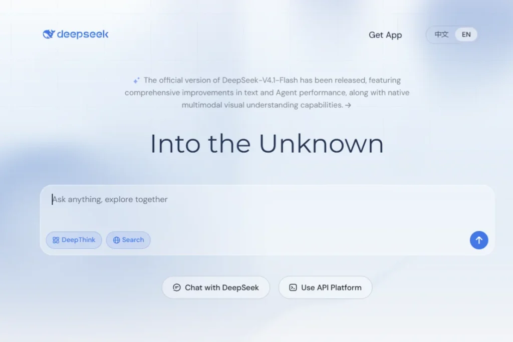
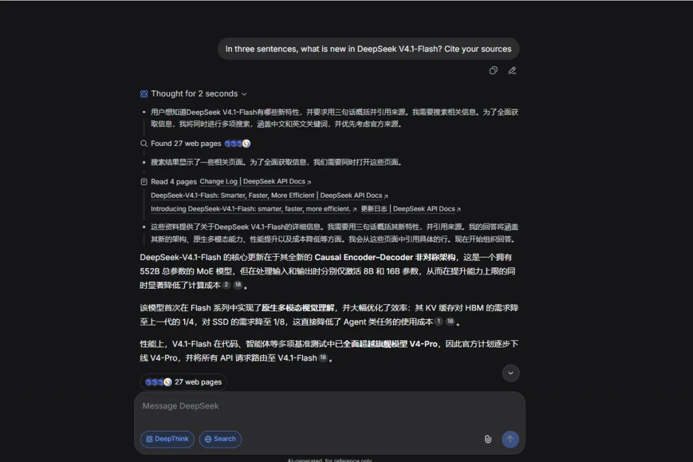
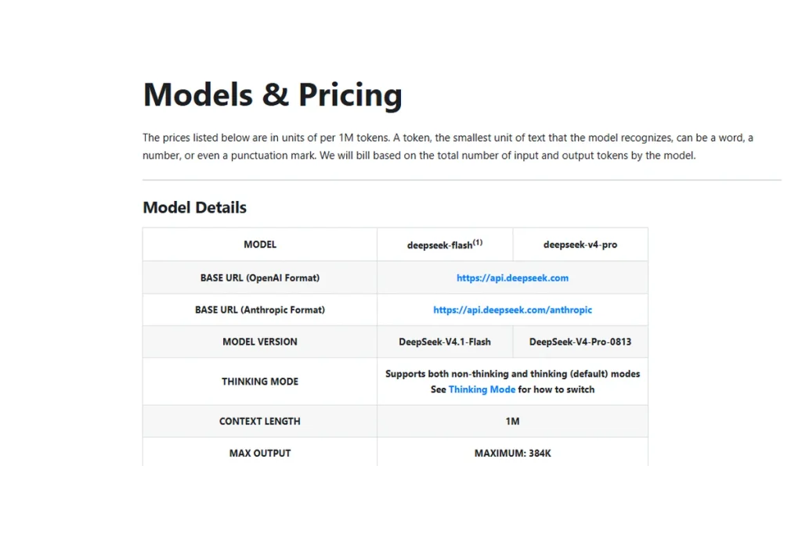
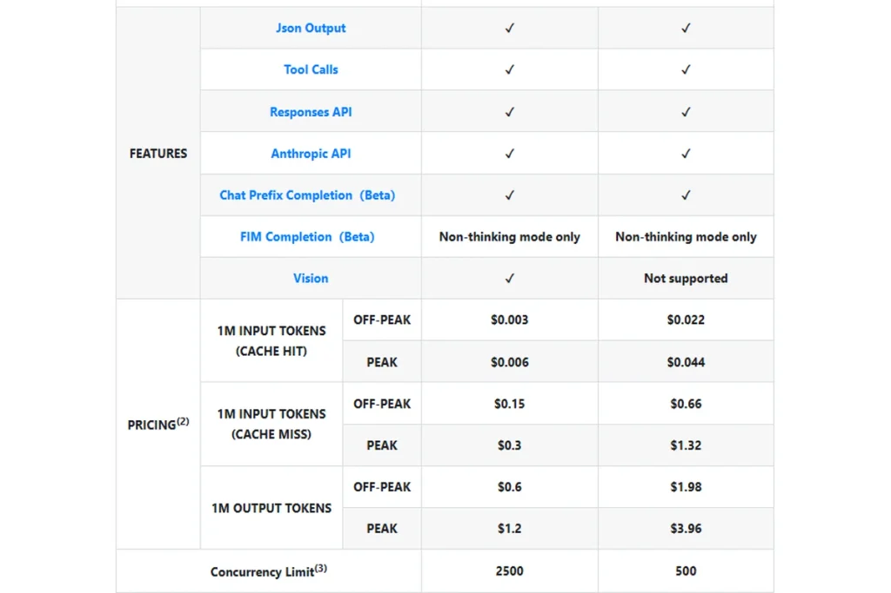

**DeepSeek AI** changed its lineup again on September 10. The Chinese lab released V4.1-Flash, an open-weight model it says beats its own V4-Pro while costing three to four times less at peak rates.

Twenty months ago, DeepSeek’s app topped the US iOS free chart and knocked roughly 17% off Nvidia’s stock in a single day. Since April 2026, the company has shipped five model releases, so any review written before summer is already out of date.

This guide covers what is new, what DeepSeek costs today, how to try it for free, and where the privacy risks sit. Every figure comes from DeepSeek’s own docs or a named outside source, and vendor benchmark claims are labeled as such. Data is current as of September 21, 2026.

## What Changed: DeepSeek’s 2026 Timeline

Seven dates explain the current lineup:

📅 **April 24:** V4 launches as V4-Pro and V4-Flash, both with a 1M-token context window and MIT-licensed open weights 📅 **July 24:** The legacy names deepseek-chat and deepseek-reasoner shut down and route to V4-Flash 📅 **July 31:** V4-Flash gets its official release after re-post-training 📅 **August 13:** The V4-Pro update adds low, high and max reasoning effort, plus native Responses API support for Codex 📅 **August 16:** Peak and off-peak pricing begins 📅 **August 21:** V4-Flash-Vision-Exp, an experimental vision model, appears 📅 **September 10:** V4.1-Flash arrives with native image understanding

The April launch set the scale. According to WinBuzzer’s launch coverage, V4-Pro has 1.6 trillion total parameters (49 billion active), and V4-Flash has 284 billion (13 billion active). It landed hours after OpenAI’s GPT-5.5.

## DeepSeek V4.1-Flash: Cheaper, Faster and Now Multimodal

DeepSeek’s homepage banner says the official V4.1-Flash release brings “comprehensive improvements in text and Agent performance, along with native multimodal visual understanding capabilities.” The model card fills in the details.

V4.1-Flash is a 552B-parameter mixture-of-experts model with a new Causal Encoder-Decoder design. It activates 8B parameters per token while reading your prompt and 16B while writing the answer. V4-Flash used 13B for both steps, according to Baseten’s analysis.

The design also shrinks memory needs. DeepSeek says the KV cache takes one quarter of the HBM and one eighth of the SSD storage of the previous generation. For coding agents that reread large codebases, that means cheaper long prompts and more cache hits.

Vision is the other headline. Baseten calls V4.1-Flash DeepSeek’s first non-experimental model with native image input. The model card lists 95.6 on DocVQA and 56.5 on MMMU-Pro, and Baseten notes the ZeroBench score still falls short of 50.

## Where V4.1-Flash Wins and Where It Still Trails

These numbers are vendor-reported. Flowtivity points out that DeepSeek evaluated its own model with its own harness settings, so treat the decimals as a guide.

✅ **Terminal-Bench 2.1:** 90.6, ahead of GPT-5.6 Sol (88.8) and Claude Opus 5.0 (89.1) ✅ **DeepSWE v1.1:** 74.2, ahead of GPT-5.6 Sol (73.0) and Opus 5.0 (74.0) ✅ **AutomationBench:** 54.8, ahead of GPT-5.6 Sol (45.8) and Opus 5.0 (50.3) ❌ **GPQA Diamond:** 90.9, behind GPT-5.6 Sol (94.1) ❌ **Terminal-Bench 4.0:** 31.2, far behind Opus 5.0 (51.8) ❌ **NL2Repo-Bench:** 64.0, behind Opus 5.0 (75.3)

The pattern is clear. V4.1-Flash is strong on short-horizon agent work and weaker on long terminal tasks. Baseten adds that a 54.8 on AutomationBench still means it fails roughly half of complex workflows, so keep a human in the loop.

## How to Use DeepSeek AI for Free (Web and App)

DeepSeek’s consumer web and mobile apps are free, with no ads or in-app purchases, according to Data Studios. The company does not publish a fixed message quota, so your limits can shift with traffic and region.

### Step 1: Open the chat

Go to chat.deepseek.com, or tap “Get App” for iOS and Android. Sign in and start typing in the prompt box. The homepage also offers “Use API Platform” if you want to build with it later.

### Step 2: Switch on DeepThink and Search

DeepThink turns on step-by-step reasoning for math, code and logic. Search lets DeepSeek pull live web results, which matters because the model itself does not know what happened last week. Use both for research questions, and leave both off for quick rewrites.

### Step 3: Give it an image

V4.1-Flash reads images natively, so upload a chart, a screenshot or a scanned table and ask for a plain-English summary. Strip out names, account numbers and anything private first. The hosted app stores your uploads on DeepSeek’s servers.

At its August update, DeepSeek also put V4-Pro into the web and app under “Expert Mode.” Check the mode picker on your account to see which models it offers today.

## DeepSeek API Pricing After the September Cut

The API serves two models today, both with a 1M-token context window and up to 384K tokens of output: deepseek-flash (V4.1-Flash) and deepseek-v4-pro. Prices below are per 1M tokens, straight from DeepSeek’s pricing page.

💰 **deepseek-flash, peak:** $0.30 input (cache miss), $1.20 output, $0.006 cache hit 💰 **deepseek-flash, off-peak:** $0.15 input, $0.60 output, $0.003 cache hit 💰 **deepseek-v4-pro, peak:** $1.32 input, $3.96 output, $0.044 cache hit 💰 **deepseek-v4-pro, off-peak:** $0.66 input, $1.98 output, $0.022 cache hit

At peak rates, Flash costs 4.4x less than Pro on input and 3.3x less on output. Off-peak prices are exactly half of peak.

Peak hours run 01:00 to 04:00 and 06:00 to 10:00 UTC, Monday through Friday, excluding Chinese public holidays. For readers on US Eastern time (EDT), that is 9 p.m. to midnight and 2 a.m. to 6 a.m. Most of your workday already gets the cheaper rate.

One wrinkle: DeepSeek’s September 10 notice said V4-Pro requests would route to V4.1-Flash from September 14 until V4.1-Pro ships. DeepSeek’s changelog says V4-Pro continues after that date, and OrcaRouter reports the plan was withdrawn after user pushback. As of September 16, V4.1-Pro had no model card, price or launch date. Confirm your model ID before you ship anything.

Both OpenAI-style and Anthropic-style endpoints work, so tools built for those formats can point at DeepSeek by changing the base URL and model name.

Related: our DeepSeek V4 coding guide shows how to wire it into your editor, and our [DeepSeek V4 vs ChatGPT comparison](/deepseek-v4-vs-chatgpt-comparison/) puts it head to head with OpenAI’s chatbot.

## Four Ways to Use DeepSeek, Compared

The table below matches each access route to a use case, a cost and a catch.

| 🏆 Option | 🤖 Model | 🎯 Best For | 💰 Cost (per 1M tokens) | ⚠️ Watch Out |
| --- | --- | --- | --- | --- |
| Web and App ChatBest Free Start | V4.1-Flash with native image input. V4-Pro via Expert Mode when your account shows it. | Everyday questions, DeepThink reasoning, live Search, image summaries | Free, no ads. No fixed public message quota. | Servers are in China. Prompts and uploads leave your device. |
| API: deepseek-flashBest Value | V4.1-Flash, 552B MoE, 1M context, 384K max output | Coding agents, long prompts, high-volume workloads | Peak: $0.30 in / $1.20 out  
Off-peak: $0.15 in / $0.60 out | Benchmarks are vendor-reported. Trails Opus 5.0 on Terminal-Bench 4.0. |
| API: deepseek-v4-proPremium Tier | V4-Pro (August 13 update), low, high and max reasoning effort | Complex agent workflows, Codex integration via Responses API | Peak: $1.32 in / $3.96 out  
Off-peak: $0.66 in / $1.98 out | 3.3x to 4.4x pricier than Flash at peak. V4.1-Pro has no launch date. |
| Self-Hosted Open WeightsMost Control | V4.1-Flash weights on Hugging Face, MIT license | Teams that need data on their own infrastructure | Your own GPU, power and ops costs | 552B parameters need data-center-class hardware. Local builds can drop the hosted app’s content moderation. |

Data as of September 21, 2026. API prices come from DeepSeek’s official pricing page. Peak hours are 01:00 to 04:00 and 06:00 to 10:00 UTC, Monday through Friday, excluding Chinese public holidays. Off-peak rates are half of peak. Prices and model availability change often, so check DeepSeek’s docs before you build.

## Is DeepSeek Safe? Privacy, Censorship and Bans

DeepSeek’s own privacy policy says it stores data on servers in the People’s Republic of China. According to Introl’s review of the policy, it collects device information, keystroke patterns, IP addresses, your requests and uploaded files.

Governments noticed. Italy’s data regulator imposed an emergency limit on January 30, 2025, and Australia, Taiwan and the Czech Republic banned it from government systems. South Korea suspended downloads, then allowed them again in April 2025 after changes. In the US, the Commerce Department restricted it on government devices, and bipartisan bills to bar it from federal systems were introduced in 2025.

Censorship is the second issue. Wikipedia notes the hosted version applies content moderation under Chinese “public opinion guidance” rules, which limits answers on topics like Tiananmen Square and Taiwan. Locally hosted open-weight versions can have that filtering removed.

✅ **Fine for the hosted app:** public information, drafts with no personal data, open-source code ❌ **Keep out of it:** client files, passwords, medical or financial records, anything under an NDA or government contract

Related: read our guide on [how to protect your data from AI chatbots](/how-to-protect-your-data-from-ai-chatbots/) before you paste anything sensitive into any of them.

## Who Should Use DeepSeek AI (and Who Should Skip It)

✅ **Developers on a budget:** Flash output at $1.20 per 1M tokens ($0.60 off-peak) keeps agent bills low ✅ **Curious users:** free chat with reasoning, search and image input ✅ **Teams that want control:** MIT-licensed weights you can host yourself ❌ **Anyone handling regulated or confidential data** on the hosted service ❌ **Users who need peak reasoning scores:** GPT-5.6 Sol leads on GPQA Diamond ❌ **Teams running long terminal agents:** Opus 5.0 leads on Terminal-Bench 4.0

To see how it stacks up against OpenAI's top model, read our [GPT-6 Astra breakdown](/gpt-6-astra-release/).

## FAQ

### Is DeepSeek AI free to use?

Yes. The DeepSeek web app and mobile apps are free, with no ads or in-app purchases. DeepSeek publishes no fixed message quota, so limits vary with traffic. The API is separate and billed per token, starting at $0.30 per 1M input tokens for deepseek-flash at peak rates.

### What is the latest DeepSeek model?

DeepSeek-V4.1-Flash, released September 10, 2026. It is a 552B-parameter mixture-of-experts model with native image understanding, a 1M-token context window and MIT-licensed open weights on Hugging Face. V4-Pro remains available in the API, and V4.1-Pro had no announced launch date as of mid-September.

### How much does the DeepSeek API cost?

_DeepSeek-flash costs $0.30 per 1M input tokens and $1.20 per 1M output tokens at peak, and half of that off-peak. DeepSeek-v4-pro costs $1.32 input and $3.96 output at peak. Cache hits are far cheaper, at $0.006 for Flash and $0.044 for Pro at peak._

### Is DeepSeek AI safe to use?

_It depends on what you share. DeepSeek’s privacy policy says data is stored on servers in China, and several governments have restricted it on official devices. Use the hosted app for public, low-risk tasks. For sensitive work, self-host the open weights or choose another provider._

### Can I run DeepSeek on my own computer?

_Not easily. The V4.1-Flash weights are open under an MIT license on Hugging Face, but the model has 552B parameters, which calls for data-center-class GPUs or a hosting provider. For most people, the free app or the API is the practical route._

## The Bottom Line: Cheap, Capable and Worth Testing With Care

DeepSeek AI now pairs agent scores that match or beat GPT-5.6 Sol and Opus 5.0 on several vendor-run tests with low per-token prices, and V4.1-Flash adds vision to the mix. The catches are real: self-reported benchmarks, weaker long-horizon results, and a privacy policy that stores your data in China.

Run one real task through the free chat this week, then send the same prompt to your current chatbot and compare. Tell us in the comments where DeepSeek won and where it fell short.

## Sources

- [CNBC: China’s DeepSeek releases preview of long-awaited V4 model as AI race intensifies](https://www.cnbc.com/2026/04/24/deepseek-v4-llm-preview-open-source-ai-competition-china.html)

## Related Reading

- [DeepSeek V4 vs ChatGPT: Which Is Better After GPT-6? [Sept 2026]](/deepseek-v4-vs-chatgpt-comparison/)
- [How to Protect Your Data From AI Chatbots (2026 Guide)](/how-to-protect-your-data-from-ai-chatbots/)
- [GPT-6 Astra Release: What OpenAI’s New Model Means for Developers](/gpt-6-astra-release/)
