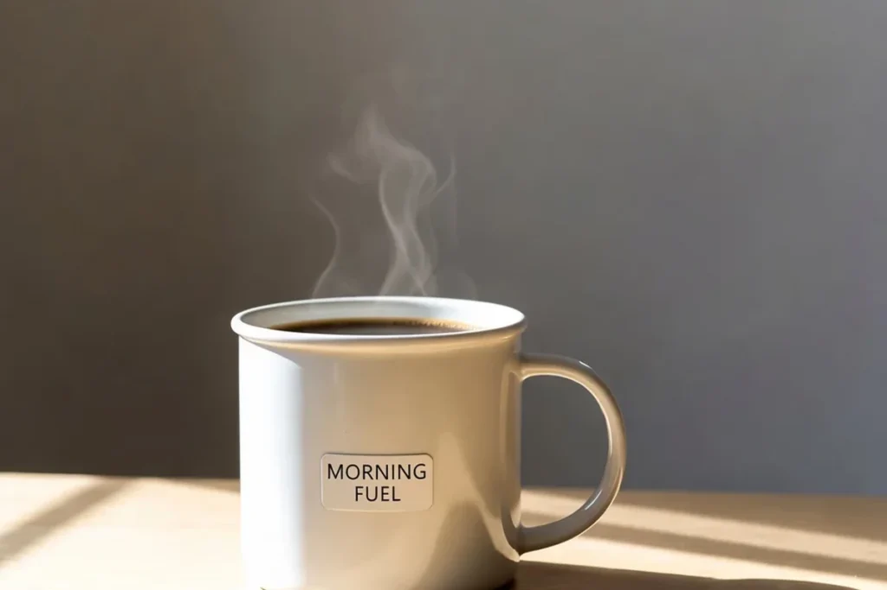
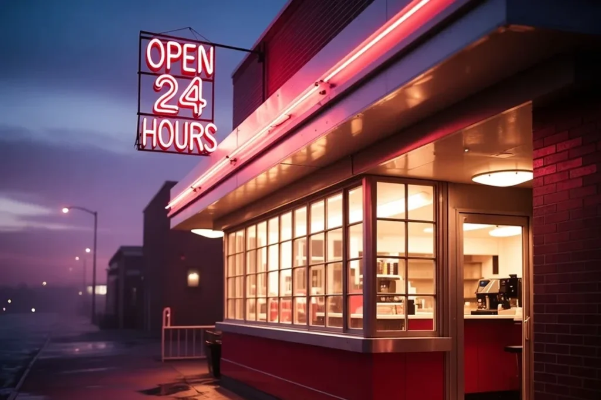
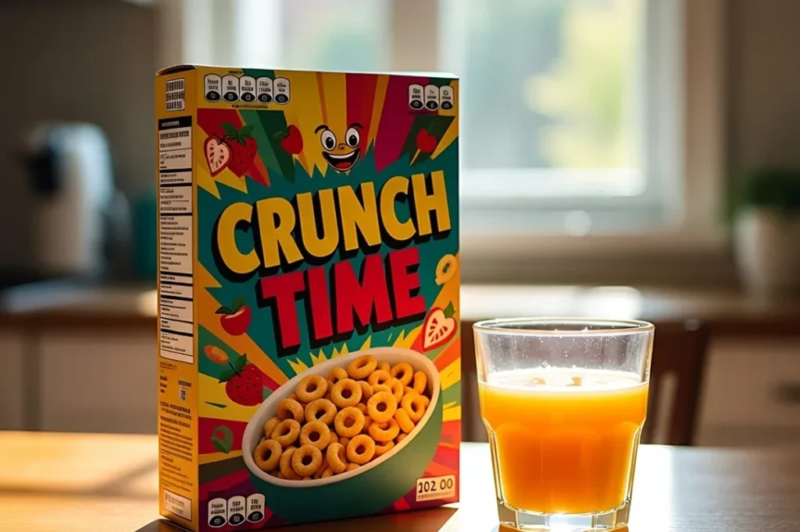

Grok Imagine 2.0 landed on August 7, 2026, and most people are still typing prompts like it’s the old Aurora model. That’s the fastest way to burn your daily credits on mediocre output. **Grok Imagine 2.0 prompts** need a different structure now, one built around region editing and readable typography, not blind luck.

The new model, officially the “Quality Mode” inside grok.com/imagine, jumped straight to #2 on the public Text-to-Image and Image Edit Arena leaderboards within a week of launch. It sits right behind OpenAI’s GPT-Image-2. That’s not a marginal update. It’s a different tool wearing the same name, and the prompting habits that worked on Grok Imagine 1.0 will hold you back here.

This guide skips the theory. You’ll get the exact prompt formula the Quality Mode responds to, three copy-paste prompts you can test today, and a side-by-side table of what changed between versions. No filler, just what moves the needle.

## Why Your Old Grok Imagine Prompts Stopped Working

Grok Imagine 1.0 was built for speed. You typed a scene, hit generate, and hoped the text on that poster didn’t come out as garbled shapes. It usually did.

Grok Imagine 2.0 flips the priority. It’s built around precision editing, not one-shot luck. Three things changed underneath the hood:

✅ **Region-level editing** through the Magic Wand tool, so you can change one part of an image without regenerating the whole thing ✅ **Multi-turn refinement**, meaning you keep iterating inside the same chat instead of rewriting your prompt from scratch ✅ **Typography that actually renders**, which is the single biggest complaint about the older model

If you’re still writing one giant paragraph and hoping for the best, you’re prompting a model that doesn’t exist anymore.

## The New Prompt Formula for Grok Imagine 2.0

Quality Mode rewards structure over poetry. Here’s the format that consistently produces usable output.

### Step 1: Lead With the Subject and the Shot Type

Start with what the camera sees, not the mood. “Close-up product shot of a matte black wireless earbud case” beats “a beautiful modern gadget floating in space.”

### Step 2: Add One Layout Instruction

Grok Imagine 2.0 handles composition instructions well. Tell it where things sit: “text centered at the top,” “product on the left third of the frame,” “negative space on the right for a headline.”

### Step 3: Specify the Text, Exactly

If you need a word on the image, put it in quotes inside the prompt itself. This is the model’s strongest upgrade, and it’s wasted if you leave text vague.

### Step 4: Use the Magic Wand for Fixes, Not a New Prompt

If the lighting is off in one corner, don’t regenerate the whole image. Select that region and describe only the fix. This is where most of the credit savings live.

## 3 Copy-Paste Grok Imagine 2.0 Prompts That Get Results

Run these as-is. Each one is built around the formula above.

### Prompt 1, product mockup with clean text:

“Studio product photo of a white ceramic coffee mug filled with hot coffee, gentle wisps of steam rising from the cup, on a light wood table, soft morning light from the left, small text label on the mug reading ‘MORNING FUEL’ in a clean sans-serif font, shallow depth of field, negative space on the right for a headline, photorealistic, 4K.”

### Prompt 2, neon signage with readable text:

“Photorealistic classic American diner storefront at dusk, glowing neon sign reading ‘OPEN 24 HOURS’ in the window, warm amber light spilling onto a wet sidewalk, cozy nostalgic atmosphere, shallow depth of field, cinematic lighting, photorealistic, 4K.”

### Prompt 3, packaging text in a lifestyle scene:

“Photorealistic breakfast table scene, a box of cereal with bold text ‘CRUNCH TIME’ on the front, a glass of orange juice, sunlight streaming through a kitchen window onto a wooden table, cozy Sunday morning atmosphere, shallow depth of field, photorealistic, 4K.”

## Grok Imagine 1.0 vs. Grok Imagine 2.0: What Changed

| Feature | Grok Imagine 1.0 | Grok Imagine 2.0 |
| --- | --- | --- |
| 📅 Release Date | February 1, 2026 | August 7, 2026 |
| 📊 Leaderboard Rank | Around #14 on public Arena | #2 on Text-to-Image and Image Edit Arena |
| ✏️ Region Editing (Magic Wand) | ❌ Not available | ✅ Full support |
| 🔤 Text Rendering | ❌ Weak, often garbled | ✅ Sharp, layout-aware |
| 🔁 Multi-Turn Refinement | ❌ Limited | ✅ Continuous in-chat editing |
| 🎬 Video Output | ⏱️ Up to 10 seconds, 720p | ⏱️ Expanded, full video pipeline |
| 💰 Access | Free tier + SuperGrok ($30/mo) | Free tier (limited) + SuperGrok ($30/mo) |

## Common Mistakes That Waste Your Credits

❌ Writing one long descriptive paragraph instead of leading with subject, then layout, then text ❌ Regenerating the entire image to fix a small detail instead of using the Magic Wand ❌ Leaving text instructions vague (“some text about coffee” instead of the exact words in quotes) ❌ Ignoring aspect ratio, since Quality Mode respects explicit ratio requests and default output often doesn’t match your platform

Compare it with rivals in our [best AI image generators](/best-ai-image-generators-2026/) ranking, and borrow lighting and framing ideas from [100 ChatGPT image prompts](/chatgpt-image-prompts-visual-commands/). The [3D figurine trend](/3d-figurine-ai-trend-chatgpt/) also makes a fun test for any image model.

## FAQ

**Is Grok Imagine 2.0 free to use?**

_Access depends on your account tier. Some users get a small daily credit allowance for free, while full unrestricted use requires a SuperGrok subscription. Check Settings > Usage inside the Grok app to see your current limits before planning a content batch around it._

**Can I still use my old Grok Imagine 1.0 prompts?**

_They will still generate an image, but you’ll miss the point of the upgrade. Quality Mode rewards structured, layout-aware prompts. Old-style single-paragraph prompts tend to produce flatter, less precise results than the new format allows._

**What is the Magic Wand tool in Grok Imagine 2.0?**

_It’s the region-editing feature that lets you select one part of an existing image and describe only the change you want there. It avoids the need to regenerate an entire image just to fix a small detail like lighting or a background object._

**Does Grok Imagine 2.0 handle text on images better than version 1.0?**

_Yes, noticeably. Typography was one of the biggest weaknesses of the earlier Aurora-based model. Quality Mode was specifically built to render legible text inside images, which matters for posters, product mockups, and UI concepts._

## The Bottom Line

[**Grok Imagine 2.0**](https://grok.com/imagine) isn’t just a speed bump over the last version, it’s a genuinely different way of working with AI images. Structure your prompts around subject, layout, and exact text, then use the Magic Wand for every small fix instead of starting over.

Try the three prompts above, then push your own edits through the region tool. That combination is where Quality Mode actually earns its #2 spot on the leaderboard

## Related Reading

- [Best AI Image Generators 2026: 7 Tools Leading Right Now [Sept Update]](/best-ai-image-generators-2026/)
- [100 ChatGPT Image Prompts I Actually Use Instead of Generic AI Photos](/chatgpt-image-prompts-visual-commands/)
- [The 3D Figurine AI Trend on ChatGPT: The Exact Prompt That Works](/3d-figurine-ai-trend-chatgpt/)
- [90s AI Photo Trend: Exact Prompts for Gemini and ChatGPT](/90s-ai-photo-trend-gemini-prompt/)
